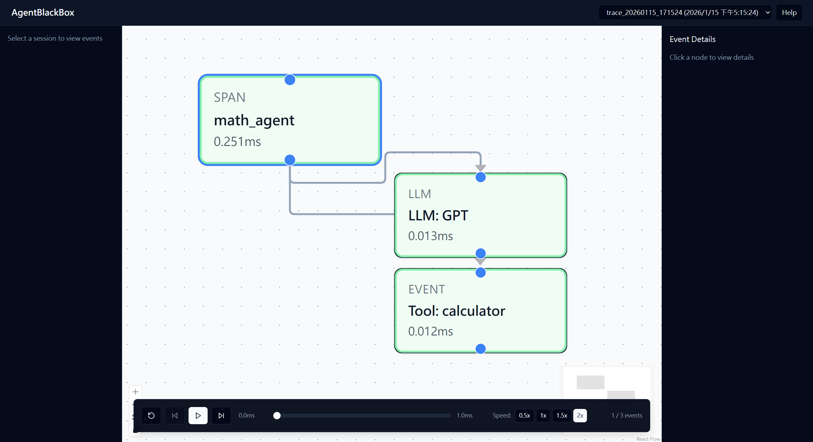

# AgentBlackBoxRecorder

<div align="center">


[](https://www.python.org/downloads/)
[](https://opensource.org/licenses/MIT)
[](https://pypi.org/project/agent-blackbox-recorder/)

**Flight Recorder for Autonomous AI Agents**

*Debug your AI agents like a pro. Capture, replay, and analyze agent execution with ease.*

[Installation](#installation) •
[Quick Start](#quick-start) •
[Features](#features) •
[Documentation](#documentation) •
[Contributing](#contributing)

</div>

---

## Overview

AgentBlackBoxRecorder is a lightweight SDK that captures every thought, decision, and action of your AI agent. When things go wrong, you can replay the entire execution like a video, inspect each step's inputs and outputs, and visualize the execution flow as an interactive graph.



## The Problem

Developing and debugging AI agents can be challenging:

- **Infinite loops** that burn through your API credits
- **Wrong tool calls** that corrupt your data
- **Unreadable logs** that make debugging a nightmare
- **"What was it thinking?"** moments that waste hours of investigation

Traditional logging and debugging tools are not designed for the complex, multi-step nature of AI agent execution. You need a tool that understands the flow of agent decisions and can replay them step by step.

## The Solution

AgentBlackBoxRecorder provides a flight recorder for your AI agents. Just like an aircraft's black box, it captures everything that happens during execution, allowing you to:

- **Replay** the entire execution like a video
- **Inspect** each step's inputs, outputs, and reasoning
- **Visualize** the execution flow as an interactive DAG
- **Analyze** performance bottlenecks and execution patterns

---

## Features

| Feature | Description |
|---------|-------------|
| **Zero-Config Tracing** | Add `@trace` decorator and you're done |
| **Visual DAG** | React Flow powered execution graph with interactive nodes |
| **Timeline Replay** | Step through execution like a debugger with play/pause controls |
| **State Snapshots** | Capture and restore agent state at any point |
| **Framework Adapters** | LangGraph, CrewAI, AutoGen support |
| **OpenTelemetry Export** | Integration with your existing observability stack |
| **Web UI** | Beautiful, interactive debugging interface |
| **Event Details** | View detailed information about LLM calls, tool calls, and state changes |

---

## Installation

```bash
pip install agent-blackbox-recorder
```

Or with Poetry:

```bash
poetry add agent-blackbox-recorder
```

---

## Quick Start

### Basic Usage

```python
from agent_blackbox_recorder import Recorder

# Initialize the recorder
recorder = Recorder(storage="./traces")

# Decorate your agent function
@recorder.trace
def my_agent(query: str):
    # Your agent logic here
    result = call_llm(query)
    tool_result = use_tool(result)
    return tool_result

# Run your agent
my_agent("What's the weather in Tokyo?")

# When something goes wrong, replay it!
recorder.replay()  # Opens interactive UI in browser
```

### LangGraph Integration

```python
from agent_blackbox_recorder import Recorder
from agent_blackbox_recorder.adapters import LangGraphAdapter
from langgraph.graph import StateGraph

recorder = Recorder(
    storage="./traces",
    adapters=[LangGraphAdapter()]
)

# Your LangGraph workflow is automatically traced
workflow = StateGraph(AgentState)
workflow.add_node("agent", agent_node)
workflow.add_node("tools", tool_node)

# Wrap the compiled graph
app = recorder.wrap(workflow.compile())

# Run and debug
app.invoke({"messages": [HumanMessage(content="Hello!")]})
```

### Recording Events Manually

```python
from agent_blackbox_recorder import Recorder

recorder = Recorder(storage="./traces")

@recorder.trace
def my_agent(question: str):
    # Record LLM call
    recorder.record_llm_call(
        model="gpt-4",
        prompt=f"Solve: {question}",
        response="I'll use the calculator tool.",
    )
    
    # Record tool call
    recorder.record_tool_call(
        tool_name="calculator",
        arguments={"expression": question},
        result=42,
    )
    
    return 42

# Run and replay
result = my_agent("What is 6 * 7?")
recorder.replay(port=8765)
```

---

## Web UI

Launch the interactive debugging interface:

```bash
# From command line
agentbox replay ./traces

# Or from Python
recorder.replay()
```

### UI Features

- **DAG Visualization**: See your agent's execution flow as an interactive graph
- **Timeline Player**: Step through each action with play/pause controls
- **Speed Control**: Adjust playback speed (0.5x, 1x, 1.5x, 2x)
- **Event Navigation**: Jump to previous/next events
- **Event Details**: View inputs, outputs, execution time, and metadata
- **Progress Tracking**: See current position in the execution timeline

---

## Architecture

```
┌─────────────────────────────────────────────────────────┐
│                    Your Agent Code                       │
│  (LangGraph / AutoGPT / CrewAI / Custom)                │
└─────────────────────┬───────────────────────────────────┘
                      │ @trace decorator
                      ▼
┌─────────────────────────────────────────────────────────┐
│              Python SDK                                  │
│  ┌─────────────┐  ┌─────────────┐  ┌─────────────────┐  │
│  │ Interceptor │  │  Snapshot   │  │ OpenTelemetry   │  │
│  │   (Hook)    │  │   Engine    │  │    Exporter     │  │
│  └─────────────┘  └─────────────┘  └─────────────────┘  │
└─────────────────────┬───────────────────────────────────┘
                      │ JSON / SQLite
                      ▼
┌─────────────────────────────────────────────────────────┐
│              React Frontend                              │
│  ┌─────────────┐  ┌─────────────┐  ┌─────────────────┐  │
│  │ React Flow  │  │   Timeline  │  │  Event Details  │  │
│  │  (DAG)      │  │   Player    │  │   Inspector     │  │
│  └─────────────┘  └─────────────┘  └─────────────────┘  │
└─────────────────────────────────────────────────────────┘
```

---

## Development Setup

### Prerequisites

- Python 3.10+
- Node.js 18+
- Poetry (for Python package management)
- npm or pnpm

### Setup

```bash
# Clone the repository
git clone https://github.com/ChangChiaEn/BlackBoxRecorder.git
cd AgentBlackBoxRecorder

# Install Python dependencies
cd packages/python
poetry install
poetry shell

# Install Web dependencies
cd ../web
npm install

# Build the web UI
npm run build

# Run tests
cd ../python
pytest tests/ -v
```

### Running the Example

```bash
# From the project root
python examples/simple_demo.py
```

This will:
1. Run a simple agent that performs an LLM call and tool call
2. Generate trace data in the `./traces` directory
3. Start the replay server on `http://localhost:8765`

---

## Project Structure

```
BlackBoxRecorder/
├── packages/
│   ├── python/              # Python SDK
│   │   ├── agent_blackbox_recorder/
│   │   │   ├── adapters/     # Framework adapters
│   │   │   ├── core/         # Core recording logic
│   │   │   ├── exporters/    # OpenTelemetry export
│   │   │   ├── server/       # Web API server
│   │   │   └── storage/      # Storage backends
│   │   └── tests/
│   └── web/                  # React frontend
│       ├── src/
│       │   ├── components/    # UI components
│       │   ├── stores/       # State management
│       │   └── api/          # API client
│       └── dist/             # Built frontend
├── examples/                 # Example scripts
├── docs/                     # Documentation and assets
└── traces/                   # Generated trace data
```

---

## API Reference

### Recorder Class

```python
from agent_blackbox_recorder import Recorder

recorder = Recorder(
    storage="./traces",        # Storage path or StorageBackend
    adapters=[...],            # Framework adapters
    auto_snapshot=True,        # Auto-capture snapshots
    enable_otel=False,         # Enable OpenTelemetry export
)
```

### Decorators

```python
@recorder.trace
def my_function():
    pass

@recorder.checkpoint
def save_state():
    pass
```

### Recording Methods

```python
# Record LLM call
recorder.record_llm_call(
    model="gpt-4",
    prompt="...",
    response="...",
)

# Record tool call
recorder.record_tool_call(
    tool_name="calculator",
    arguments={...},
    result=...,
)

# Start replay UI
recorder.replay(port=8765, open_browser=True)
```

---

## Contributing

We welcome contributions! Please see our [Contributing Guide](CONTRIBUTING.md) for details.

### Development Workflow

1. Fork the repository
2. Create a feature branch
3. Make your changes
4. Add tests
5. Submit a pull request

---

## License

This project is licensed under the MIT License - see the [LICENSE](LICENSE) file for details.

---

## Acknowledgments

Built with love for the AI Agent community. Special thanks to all contributors and users who help improve this project.

---

<div align="center">

[Report Bug](https://github.com/ChangChiaEn/AgentBlackBoxRecorder/issues) •
[Request Feature](https://github.com/ChangChiaEn/AgentBlackBoxRecorder/issues) •
[View Documentation](docs/)

</div>
